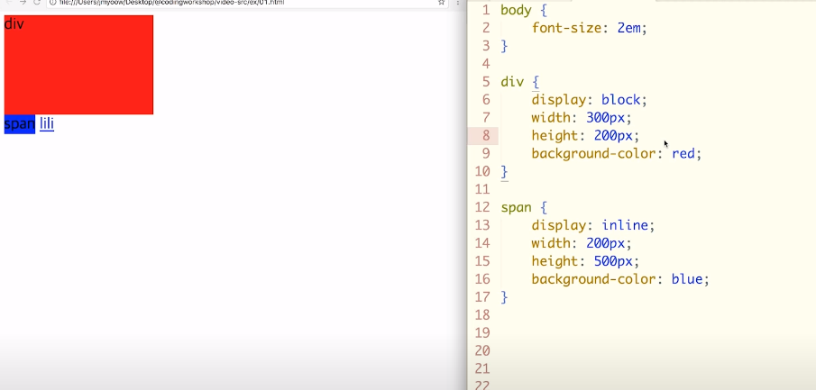
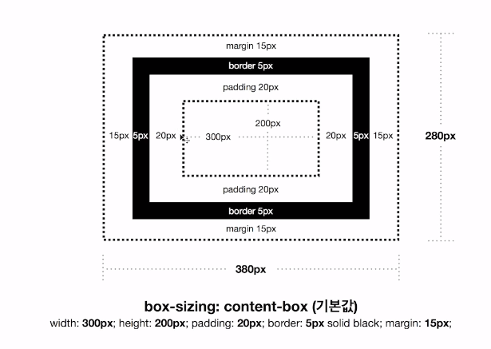
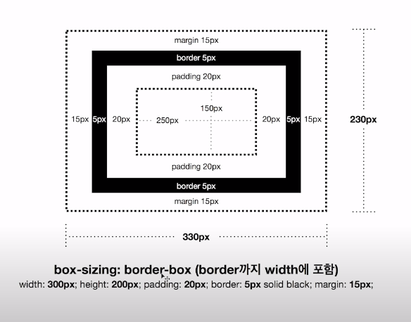
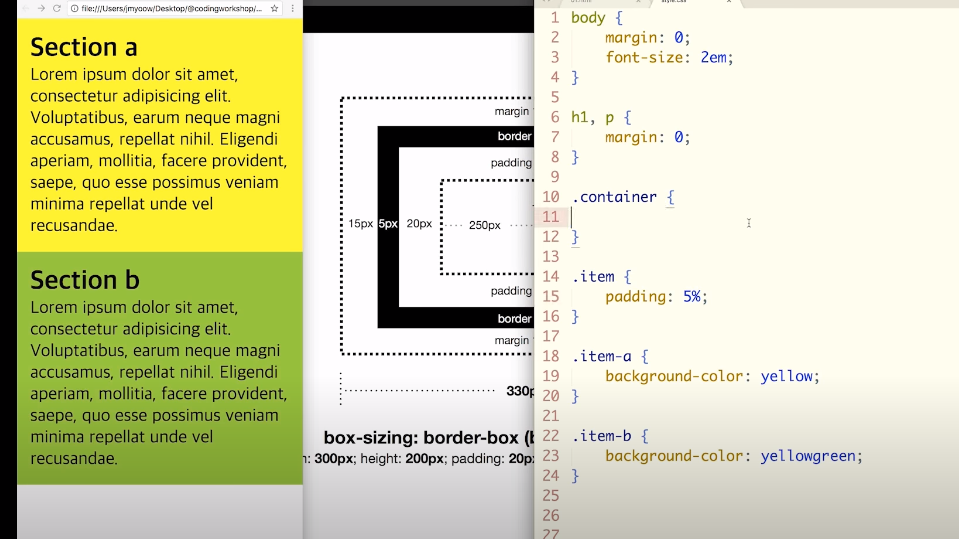
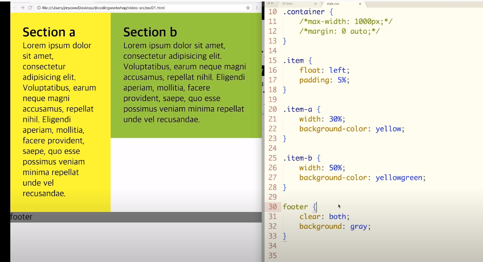
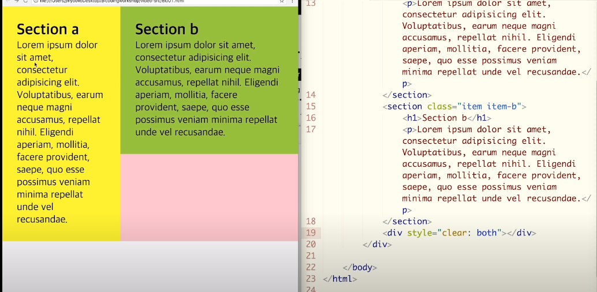
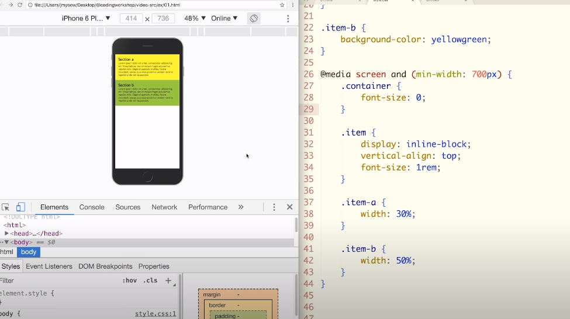

# display

- block
- inline
- inline-block : inline과 block 속성을 동시에 가짐
- none : 화면에서 사라짐 (안보임, 숨김)

`
`는 display 기본 값이 block, `<sapn>`은  inline이다.

때문에 span 태그에는 width, height 조절이 불가능하다.

but, display 속성을 inline-block으로 지정해주면 width, height 조정이 가능해진다.

# CSS Box Model

`box-sizing : border-box`

테두리까지 합쳐서 width값이 계산됨

# 정렬

- `vertical-align: top;`

부모의 font-size에 유의 (시멘틱 태그 줄 바꿈을 위해 사용된 엔터 처리가 줄을 차지할 수 있음)

- `margin: 0 auto;`

- `float: left;` : 왼쪽으로 감싸고 돌기

  자식  elements에 float 속성을 적용했다면, 부모 element가 끝나는 시점에 **`clear`를 적용**하자

- `clear: left;`, `clear: right;`, `clear: both` : float 속성 취소

float가 끝나는 지점에 clear 추가

요즘에는 아래 방법을 더 많이 씀 (가상 엘리먼트 추가)

# media를 통한 레이아웃 설정

